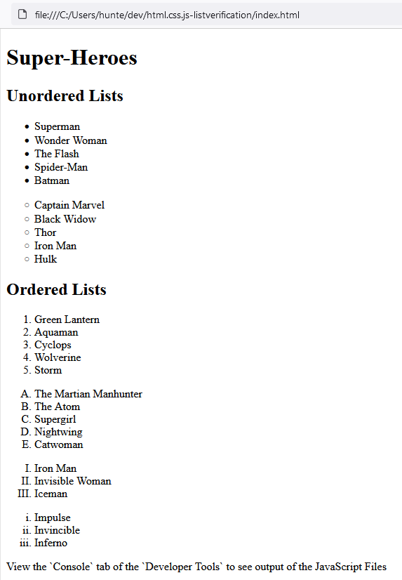

# List Verification

* **Purpose** - To gain familiarity with HTML list elements

## Objective
* For this assignment, learners will need to create an HTML file with the following elements:
  1. An unordered list with in-line style of `list-style-type:disc;`. This list should contain 5 super-hero names, each item being a list item.
  2. An unordered list with in-line style of `list-style-circle;`. This list should contain 5 super-hero names, each item being a list item.
  3. An ordered list with `type="1"`. This list should contain 5 super-hero names, each item being a list item.
  4. An ordered list with `type="A"`. This list should contain 5 super-hero names, each item being a list item.
  5. An ordered list with `type="I"`. This list should contain 5 super-hero names, each item being a list item.
  6. An ordered list with `type="i"`. This list should contain 5 super-hero names, each item being a list item.

Here is an example of what the HTML file may look like:

## How to Download

#### Part 1 - Forking the Project
* To _fork_ the project, click the `Fork` button located at the top right of the project.

#### Part 2 - Navigating to _forked_ Repository
* Navigate to your github profile to find the _newly forked repository_.
* Copy the URL of the project to the clipboard.

#### Part 3 - Cloning _forked_ repository
* Clone the repository from **your account** into the `~/dev` directory.
  * if you do not have a `~/dev` directory, make one by executing the following command:
    * `mkdir ~/dev`
  * navigate to the `~/dev` directory by executing the following command:
    * `cd ~/dev`
  * clone the project by executing the following command:
    * `git clone https://github.com/MYUSERNAME/NAMEOFPROJECT`

#### Part 4 - Check Build
* Ensure that the tests run upon opening the project.
    * You should see `Tests Failed: 99 of 99 tests`

## How to Submit

#### Part 1 -  _Pushing_ local changes to remote repository
* from a _terminal_ navigate to the root directory of the _cloned_ project.
* from the root directory of the project, execute the following commands:
    * add all changes
      * `git add .`
    * commit changes to be pushed
      * `git commit -m 'I have added changes'`
    * push changes to your repository
      * `git push -u origin master`

#### Part 2 - Submitting assignment
* from the browser, navigate to the _forked_ project from **your** github account.
* click the `Pull Requests` tab.
* select `New Pull Request`
